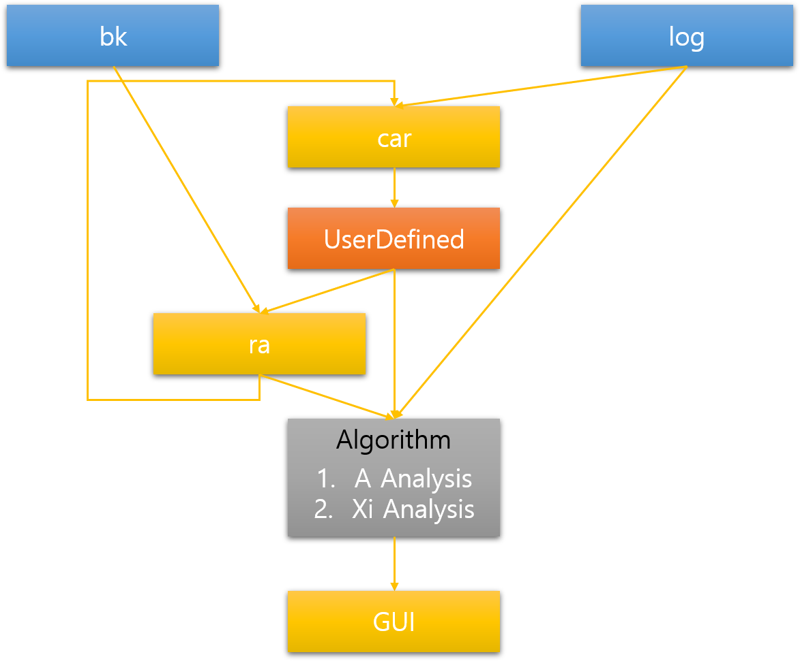

# 작가추천 시스템



```
파란색 : 데이터 베이스
노란색 : 사용자 인터페이스 (사용자가 사용가능한 인터페이스)
주황색 : 상위 추상 클래스
회색 : 분류 알고리즘

bk : Bookmark, 사용자가 북마크한 태그 목록, 작가 목록, 시리즈, 그룹, 캐릭터 목록이 포함된 데이터
log : 사용자 다운로드 기록
car : Custom Artist Recommendation, 일반 사용자용 커스텀 작가 추천 시스템
ra : Recommend Artist, 마이너 사용자용 작가 추천 시스템. car에 추가하기 곤란한 실험적인 기능들이 많이 포함되어있음
UserDefined : log->Algorithm 연결과 ra, car를 구분짓기위한 추상 클래스. 활성화되면 ct를 초기화한다.
Algorithm : 분석전 Custom Tags(ct) 목록을 만들고, 이를 설정된 알고리즘을 사용해 분석한다

log->Algorithm연결 : 프로그램 시작시 log를 불러와 작가 추천 목록을 나열한다
log->car 연결 : car는 일반 사용자용이며, 기본적으로 log를 불러와 나열시킨다. car이 성공적으로 log를 불러오면 ra를 켠다. 만약 car이 켜지기전 ra가 켜져있다면, ra에서 만들어진 목록을 가져온다. 사용자가 갱신하면 ct를 커밋한다.
bk->ra 연결 : 북마크 기록을 ct에 추가한다. 작가만 지원함
log->ra 연결 : log 기록을 ct에 추가한다.
```
