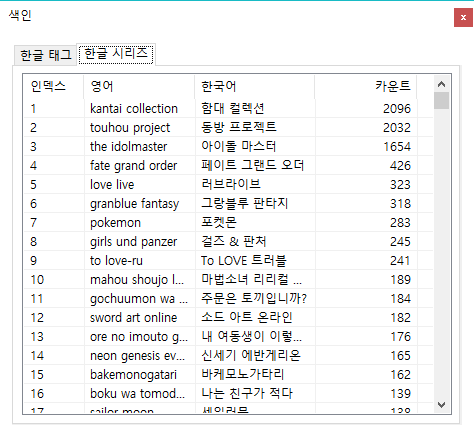

# Hitomi Copy 도움말

히토미 카피는 히토미 작품 다운로드를 목적으로 만들어진 다운로더입니다. 정확한 명칭은 Robust Hitomi Copy Machine이며 윈도우의 copy툴인 robocopy에서 영감을 얻었습니다. 저는 히토미 카피가 만들어지기 전엔 Hi downloader를 주로 썼었는데 불편한 점이 많아 직접 만들고자 했던게 여기까지 오게 되었네요. 그래서 히토미 카피는 Hi downloader와 유사한 점이 많습니다.

이 문서는 히토미 카피의 모든 기능과 자주 문의하는 오류에 관하여 정리한 문서입니다. 기타 문의나 이 문서로 해결되지 않는 오류는 koromo.software@gmail.com 으로 메일주시면 하루안에 답해드리겠습니다.

1. [프로그램 사용법](#1-프로그램-사용법)
2. [오류 FAQ](#2-오류-FAQ)
3. [향후 계획](#3-향후-계획)
4. [기타 여러가지](#4-기타-여러가지)

# 1. 프로그램 사용법

## 1.1. 검색하는 방법

제목, 히토미 번호, 작가 이름 등 아무거나 집어넣으면 알아서 검색이 됩니다. 다만, 좀 더 엄격한 검색을 위해선 다음과 같은 검색방법을 알아야합니다.

<span style="display:block;text-align:center"></span>

기본적으로 어떤 검색어를 타이핑하면 위 사진과 같이 자동완성 목록이 표시됩니다. 이 자동완성 목록이 표시되면 키보드 화살표 버튼으로 아이템을 선택할 수 있으며, 특정 아이템을 선택하고 엔터키를 누르거나, 마우스 더블클릭으로 검색창에 추가시킬 수 있습니다. 자동완성 오른쪽에 표시된 숫자는 해당 검색어로 검색하면 몇 개의 검색결과가 나오는지 보여줍니다. 이 검색결과는 설정된 언어는 적용되나, 제외 태그를 적용하지 않은 모든 검색결과입니다.

`Prefix :` 어떤 검색어 앞에 붙여서 검색 범위를 줄이는 핵심 키워드입니다. `artist`, `group`, `character`, `series`, `tag`, `tagx`, `female`, `male`, `type`, `recent`, `/`, `?` 이렇게 12가지가 있습니다.

단순하게 `michiking`을 검색하면 작가 뿐만아니라 제목에 포함된 michiking, 시리즈에 포함된 michiking 등을 모두 검색하게 됩니다. 여기에 `Prefix`인 `artist`를 붙히면 특정 작가를 모두 검색합니다. `artist:michiking`으로 검색하면 작가가 michiking은 작품 목록을 검색할 수 있습니다.

검색어에 공백이 들어간 경우엔, `_`를 붙여 검색하면됩니다. 가령, `hinahara emi`를 검색하려는 경우, `artist:hinahara_emi`를 검색하면됩니다.

`tagx` 키워드는 제외 태그입니다. 설정에 있는 제외 태그들이 기본적으로 포함됩니다.

`type`은 `doujinshi`, `manga`, `artistcg`, `gamecg`를 검색할 수 있는 키워드입니다.

`recent`는 최근 작품을 불러옵니다. 가령, `recent:0-25`라고 검색하면, 최신순으로 0번재 작품부터 25개를 가져오라는 명령이됩니다. 검색어에 `recent`가 포함되면, 다른 검색어들은 모두 무시되며, 다음 목록을 엔터키로 쉽게 불러올 수 있게 `recent:25-25`처럼 작품의 개수만큼 시작위치가 늘어납니다.

`/` 키워드는 검색 결과를 보여줄 시작위치입니다. 가령, `artist:michiking /5`를 검색하면, 5번째 작품부터 검색결과를 보여줍니다.

`?` 키워드는 검색 결과의 개수입니다. 가령, `artist:michiking /5 ?5`를 검색하면, 5번째 작품부터 5개의 검색결과를 보여줍니다. `/`, `?` 키워드가 같이 사용된다면, 어느게 먼저 나오든 `/` 키워드 먼저 처리되며, `?`가 나중에 처리됩니다. `?` 키워드도 `/`와 마찬가지로 독립적으로 사용될 수 있습니다.

히토미 카피의 검색 방법은 기본적으로 And입니다. 모든 검색어는 공백으로 나뉘며, 각각의 검색어들을 모두 포함한 작품이 검색됩니다.

<span style="display:block;text-align:center"></span>

히토미 카피엔 퍼지 검색 기능이 있습니다. `설정->고급설정->기타->Using Fuzzy 활성화 후->설정 저장`으로 퍼지 검색 기능을 켜고 끌 수 있습니다. 퍼지 검색기능은 위 사진과 같이 가장 비슷한 순으로 자동완성 목록을 보여줍니다. 오른쪽에 표시되는 숫자는 타이핑된 단어와 비슷한 단어와의 차이를 나타냅니다.

---

## 1.2. 검색기(Finder) 사용방법

메인창에서 검색할 때 많은 검색결과가 표시되어야하는 경우 Finder가 실행됩니다. 다음과 같이 직접 실행할 수도 있습니다.

<span style="display:block;text-align:center"></span>

검색 버튼에서 오른쪽 마우스를 클릭하고, `Finder 열기(F)`를 클릭합니다.

Finder는 메인창의 검색 방법과 완전히 동일하나, 검색결과를 텍스트 형식으로만 보여준다는 면과 모든 검색결과를 표시해준다는 면에서 메인창의 검색기와 다릅니다.

<span style="display:block;text-align:center"></span>

또한, Finder는 시리즈, 태그에 한해 일부 항목에서 한글 번역된 단어를 보여줍니다. 각각의 항목들을 클릭하면 자세한 검색결과를 볼 수 있습니다.

---

## 1.3. 작품/작가/그룹 창

<span style="display:block;text-align:center"></span>

위 사진처럼 아무거나 검색해주고, 검색결과를 더블 클릭하면 다음과 같은 창을 볼 수 있습니다.

<span style="display:block;text-align:center"></span>

이 창에서는 여러가지 정보들과 기능들을 보여줍니다. `업로드된 시간`을 추정해서 보여주며, `익헨에서 열기`, `히토미에서 열기`, `북마크에 추가`, `댓글 보기`, `작가 찾기`, `그룹찾기`, `시리즈 찾기`, `캐릭터 찾기`, `미리보기`, `다운로드` 기능을 사용할 수 있습니다. 또한, 제목, 작가, 그룹, 시리즈, 캐릭터를 각각 클릭하면 클립보드에 내용이 복사됩니다.

`업로드된 시간`은 실제로 히토미에 업로드된 시간이 아닌 히토미 고유 번호로 추정한 시간입니다. 버전이 업데이트될 때 마다 최신 날짜가 업데이트 되므로, 최신 데이터의 경우엔 추정 날짜가 정확하지 않을 수 있습니다.

`댓글 보기` 기능은 익헨에 올라온 게시물을 찾아 댓글을 보여줍니다. 익헨에 업로드되지 않았거나, 삭제된경우 댓글을 볼 수 없습니다.

`미리보기` 기능은 작품의 전체, 또는 일부를 한 눈에 보여줍니다. 이 기능은 모든 이미지를 다운로드 받기 때문에 상단한 메모리를 사용할 수 있으며, 과하게 사용하면 프로그램이 강제종료될 수 있습니다. 미리보기에서 파일을 불러오는 도중 창을 종료하면 다운로드가 취소되긴하지만 `Temp`파일이 남을 수 있습니다. 이럴땐, `%temp%` 폴더에서 `*.tmp` 파일을 모두 삭제하세요.

`시리즈 찾기`, `캐릭터 찾기`는 Finder를 사용하여 해당 시리즈나 캐릭터를 찾습니다. 여러개인 경우 맨 처음에 표시된 하나만 검색합니다.

`북마크에 추가` 기능은 후에 서술할 북마크 기능을 참고하세요.

`작가 찾기`, `그룹 찾기`는 특정 작가나 그룹의 모든 작품 목록을 보여줍니다. (단, 여러개인 경우 맨 처음에 표시된 하나만 검색합니다.)

<span style="display:block;text-align:center"></span>

왼쪽에는 해당 작가/그룹의 모든 태그 목록이 표시되며, 오른쪽엔 모든 작품 목록이 표시됩니다. 오른쪽하단엔 `다운로드` 버튼과 `모두 다운로드` 버튼이 있는데, `다운로드` 버튼은 선택된 작품만을 다운로드하며, `모두 다운로드` 버튼은 해당 작가/그룹의 모든 작품을 다운로드하고 창을 종료합니다.

<span style="display:block;text-align:center"></span>

오른쪽 작품 목록에서 오른쪽 마우스 클릭하면 위와 같은 메뉴가 표시됩니다. 

`제목 비슷한 작품 선택 취소(S)` 는 가장 최근의 작품 하나만 남기고, 모든 비슷한 제목을 가직 작품을 선택 취소합니다. 이 기능은 `Text Matching Accuracy`에 따라 작동합니다.

`Text Matching Accuracy`는 `설정->고급설정->UI->Text Matching Accuracy`로 설정할 수 있습니다. 최대 몇 글자가 틀리야 제목이 비슷하다고 할 것인지 설정합니다.

---

## 1.4. 두 가지 형식의 검색 결과

히토미 카피는 두 가지 형식을 통해 검색 결과를 보여줍니다. 하나는 `1.3`절 처음에 표시된 것처럼 검색결과를 표시하는 형식이며, 다른 하나는 다음 사진과 같이 표시되는 방식입니다.

<span style="display:block;text-align:center"></span>

기본 설정은 첫 번째 설정이며, 두 번째 방법으로 설정하려면, `설정->고급설정->UI->Detailed Search Result`를 활성화하면 됩니다.

`Detailed Search Result`가 활성화 되면 사용할 수 있는 설정으로 `Using EXH Base Opener`설정과, `Show Page Count` 설정이 있습니다.  `Using EXH Base Opener`를 활성화하면 검색결과 오른쪽 하단의 `히토미에서 열기` 버튼이 `익헨에서 열기` 버튼으로 바뀌며, `Show Page Count`를 활성화하면 썸네일 오른쪽 하단에 해당 작품의 페이지 수가 표시됩니다. 페이지 수는 온라인에서 가져오므로, 표시되는데 조금 시간이 걸릴 수 있습니다.

검색결과의 썸네일 왼쪽 상단에 `★`가 표시되는 경우가 있습니다. 노란색 별이 표시될 경우 이미 다운로드된 작품이라는 표시이며, 빨간색 별이 표시될 경우 해당 작가 또는 그룹이 북마크에 있다는 표시이고, 파란색 별이 표시될경우 Hidden Data란 표시입니다. 이 `★` 표시는 앞에 세 가지 조건에 따라 중복되어 나타날 수 있습니다.

---

## 1.5. 작가추천 기능 사용방법

메인창에서 작가추천 탭으로 가면 `다운로드 로그`에 따라 추천된 작가 목록을 볼 수 있습니다. 마우스 휠로 아래 스크롤하면 더 많은 추천 작가를 볼 수 있습니다. 많은 항목이 표시되면 오류가 발생할 수 있으므로 왼쪽 상단의 `정리` 버튼을 통해 자주 정리해 주시기 바랍니다.

히토미 카피에는 총 네 가지의 작가추천 목록을 생성하는 방법이 있습니다. `설정->고급설정->작가추천`에서 이 네가지 추천 방법 중 하나를 선택할 수 있습니다. 아무것도 선택되지 않으면 `Default Analysis`이며, 나머지 세 개는 `Xi Analysis`, `RMS Analysis`, `Cosine Analysis` 중 하나를 선택하여 활성화할 수 있습니다. 이 세 개중 하나를 선택하면 `Default Analysis`는 자동으로 해제됩니다. 각각의 방법을 텍스트로 설명하는건 무의하므로 설명하지 않겠습니다. 직접 사용해보고 마음에 드는 걸 선택하시기 바랍니다.

작가추천에서 왼쪽 상단의 `커스텀 작가 추천`을 누르면 사용자 정의에 따라 작가 추천 목록을 볼 수 있는 `Custom Aritst Recommendation`이 실행됩니다.

<span style="display:block;text-align:center"></span>

왼쪽엔 현재까지 다운로드한 작품들의 모든 태그를 취합하여 보여주며, 오른쪽엔 이를 통해 분석된 작가 목록을 보여줍니다. 왼쪽의 태그 목록은 다중 선택이 가능하며, `Ctrl+A`로 모두 선택할 수 있고, `Delete`키로 선택된 항목을 삭제할 수 있습니다.

하단엔 연산법이 세 가지가 있는데, `곱셈`은 극단적인 목록을 생성하고자 할때 유용하며, `덧셈`은 일반적인 목록을 생성하고자 할 때 유용합니다.

모든 세팅이 끝나고 오른쪽 하단의 `업데이트` 버튼을 클릭하면 작가 추천 목록이 업데이트 됩니다.

---

## 1.6. 북마크 기능 사용방법

메인창에서 `F3`키를 누르면 실행할 수 있습니다.

<span style="display:block;text-align:center"></span>

작가/그룹/작품은 다른 창에서 각각 북마크할 수 있지만, 태그/시리즈/캐릭터는 직접 수동으로 추가해야됩니다.

<span style="display:block;text-align:center"></span>

작가 북마크에 한해 그룹핑 기능이 있으며, 위와 같이 마우스 오른쪽클릭을 통해 그룹을 설정할 수 있습니다.

---

## 1.7. 색인

메인창에서 `F4`키를 누르면 실행할 수 있습니다.

<span style="display:block;text-align:center"></span>

`색인`은 번역된 모든 한글 태그, 한글 시리즈를 보여줍니다.

---

## 1.8. 기록

메인창에선 `설정->기록`, 작품/작가/그룹창에선 `F2`키를 눌러 `기록`을 실행할 수 있습니다. 메인창에서 실행할 경우 모든 기록을, 작품/작가/그룹창에서 실행할 경우 해당하는 작품/작가/그룹의 기록을 보여줍니다.

<span style="display:block;text-align:center"></span>

왼쪽엔 모든 기록들이 날짜 순으로 정렬되어 표시되며, 오른쪽엔 다운로드 날짜에 따라 년/월/일/시간에 따른 순으로 정렬한 목록을 보여줍니다.

---

## 1.9. 작가 이동

메인창에서 `F5`키를 누르면 실행할 수 있습니다.

<span style="display:block;text-align:center"></span>

작가를 입력하면 작가 창으로 이동합니다.

---

## 1.10. 패키지 뷰어

<span style="display:block;text-align:center"></span>

각종 공지사항이나 작품 추천 목록을 볼 수 있는 패키지 뷰어입니다. 이 패키지 뷰어는 버전 업데이트에 영향을 받지 않습니다. 프로그램 시작시 자동으로 실행되며 `설정->고급설정->기타->Off PackageViewer`를 통해 끌 수 있습니다.

---

## 1.11. 다운로드 경로 설정방법

많은 분들이 어려워하시는 부분이라 따로 설명드리고자 합니다. 다운로드 경로는 `설정` 탭에서 바꿀 수 있습니다. 이 경로는 히토미 작품이 다운로드되는 경로이며, 마루마루/익헨은 별도의 경로에 다운로드 됩니다.

다운로드 경로는 히토미 작품 폴더가 생성되는 규칙을 나타냅니다. 가령 `C:\Hitomi\{Artists}\{Title}`의 경우 `C:\Hitomi\` 폴더를 기본으로 하며, 하위 폴더에 `{Artists}` 폴더를 만들어 `{Title}`를 가진 폴더를 만들어 작품을 저장합니다. `{Aritsts}`, `{Title}`과 같이 `{}`로 둘러 쌓인 것을 토큰이라 부릅니다.

이런 토큰은 총 7개가 제공됩니다. `{Title}`, `{Aritst}`, `{Id}`, `{Date}`, `{Series}`, `{Search}` 이렇게 7개입니다. 경로에는 작품을 식별할 수 있는 `{Title}`, `{Id}` 토큰 중 반드시 하나가 포함되어야 합니다. `{Search}` 토큰은 검색어를 나타냅니다.

---

## 1.12. 익헨/마루마루 다운로더

검색창에 익헨/마루마루 주소를 입력하면 다운로드할 수 있습니다. 마루마루의 경우 Lock이 걸린 작품은 다운로드 받을 수 없습니다. 마루마루에 한해 자동 갱신 기능이 제공됩니다.

마루마루 갱신 기능은 프로그램 실행 후 백그라운드로 업데이트 체크가 진행되며, 업데이트 체크를 완료하면 다음과 같은 창이 뜨게됩니다.

<span style="display:block;text-align:center"></span>

갱신하고자하는 만화를 선택하고 오른쪽 하단의 `갱신하기`를 눌러 최신 상태로 갱신할 수 있습니다. 갱신도중 다운로드가 안되거나 실패하는 경우, 왼쪽 하단의 `모든 실패 데이터 삭제`를 클릭해 다시시도할 수 있습니다.

작품수가 많을 수록 업데이트 체크가 느려지며, 중복해서 다운로드할 경우 치명적인 오류가 발생할 수 있으니 절대로 중복다운로드를 하지마세요.

---

## 1.13. 생성되는 모든 파일 목록

| 파일 이름             | 설명                                |
| -------------------- | ----------------------------------- |
| setting.json         | 사용자 설정 파일입니다.|
| metadata.json        | 히토미 사이트에서 다운로드한 작품 목록입니다. |
| hiddendata.json      | 403 Forbidden 데이터 목록입니다.|
| log.json             | 다운로드 기록을 저장하는 파일입니다.|
| bookmark.json        | 북마크를 저장하는 파일입니다.|
| bookmark_backup.json | 프로그램 시작시 자동으로 백업한 bookmark.json입니다.|
| mmsetting.json       | 마루마루 다운로드 기록을 저장하는 파일입니다.|
| snapshot_XXX.json    | gbt 사용시 1분마다 생성되는 파일입니다.|
| gallery_block.json   | gbt의 최종 결과 파일입니다.|
| 403.json             | ct의 최종 결과 파일입니다.|
| isotest.log          | 고립 태그 분석시 생성되는 결과 파일입니다.|
| tagdata.json         | 현재 사용하지 않습니다.|

---

## 1.14. setting.json

히토미 카피는 사용자가 프로그램을 효율적으로 관리하기 위한 세부 설정을 제공하고 있습니다. 일부 설정은 `고급 설정`에서 바꿀 수 있으나 모든 설정을 바꾸려면 이 파일을 수정하세요. `setting.json`을 통해서도 바꿀 수 없는 설정은 `Realtime Variable Update System`를 이용하시기 바랍니다.

| 설정 내용 | 설명 |
|---|---|
|Path|히토미 작품이 다운로드되는 경로입니다.|
|MarumaruPath|마루마루 만화가 다운로드되는 경로입니다. 기본적으로 히토미 카피가 있는 폴더로 설정됩니다.|
|ExclusiveTag|제외 태그입니다.|
|Zip|자동 압축을 실행할지의 여부를 설정합니다. 이 설정을 활성화하면, 히토미 작품 다운로드 완료후 자동으로 zip압축을 실행합니다. 압축이 실행되면 많은 CPU Load가 발생할 수 있습니다.|
|MaximumThumbnailShow|표시할 검색결과의 최대 개수입니다.|
|Thread|다운로드시 사용할 쓰레드 개수입니다. 기본적으로 논리 코어수 * 3으로 설정됩니다.|
|Language|설정언어입니다.|
|WaitInfinite|파일 다운로드시 응답이 없을 경우 무제한 기다릴 것의 여부를 설정합니다.|
|WaitTimeout|무제한 기다리지 않는다면 몇 ms기다릴지 설정합니다.|
|SaveJson|히토미 작품이 다운로드될 때 작품 정보가 담긴 json파일을 저장할지의 여부를 설정합니다. 기본적으로 활성화되어있습니다.|
|RecommendPerScroll|작가추천 탭에서 아래로 스크롤할 때마다 몇 개의 결과를 보여줄지 설정합니다. 기본값은 10입니다.|
|TextMatchingAccuracy|최대 몇 글자가 틀려야 제목이 비슷하다고 할 것인지 설정합니다.|
|UninterestednessArtists|작가추천에서 `관심 없음` 버튼을 눌러 삭제한 작가 목록입니다.|
|RecommendNMultipleWithLength|작가추천 목록 생성시 해당 작가의 Article 수를 곱하지 않습니다. 이 설정은 단순한 작가추천 결과를 제공합니다.|
|RecommendLanguageALL|작가추천시 모든 언어를 기반으로 목록을 생성합니다.|
|ReplaceArtistsWithTitle|{Aritsts}를 단어의 첫 글자 대문자로하여 치환합니다.|
|UsingLog|모든 진행사항을 기록하는 Log창을 프로그램 시작시 실행합니다. 히토미 카피의 모든 변수를 제어할 수 있으며, 모든 기능을 실행할 수 있습니다.|
|DetailedLog|매우 자세한 로그 결과를 생성합니다. 일반 Log창으로도 잡히지 않는 오류가 발생하면 이 기능을 사용하세요.|
|RecommendAutoRemove|현재 사용되지 않습니다.|
|DetailedSearchResult|검색결과를 자세히 표시합니다.|
|UsingExHentaiBaseOpener|검색결과에서 `히토미으로 열기`가 아닌 `익헨으로 열기`가 기본으로 설정됩니다.|
|UsingDriver|Driver를 사용해 안정적으로 이미지를 다운로드합니다.|
|LatestNotice|가장 최근 불러온 공지사항의 번호입니다. 아직 기능이 구현되지 않았습니다.|
|UsingOnlyFMTagsOnAnalysis|작가추천 시 `female:`, `male:` 태그만 사용합니다.|
|CustomAutoComplete|사용자가 설정한 자동완성 목록입니다.|
|AutoSync|프로그램 시작시 데이터를 동기화합니다.|
|OpenWithFinder|Tag/Series/CharacterInfo 대신 Finder을 사용할지 여부를 설정합니다.|
|LoadPreviewMaximum|미리보기 시 최대 몇 장의 이미지를 가져올 지 설정합니다.|
|ShowPageCount|페이지 수를 보여줄 지의 여부를 설정합니다.|
|AutoCompleteShowCount|최대 몇개의 자동완성 목록을 보여줄 지 설정합니다.|
|NotifySyncDelay|데이터 동기화 후 몇 시간이 지나야 데이터 동기화 알림을 띄울지 설정합니다.|

---

# 2. 오류 FAQ

## 2.1. 데이터 다운로드시, 데이터 동기화시 오류가 발생합니다

메일을 주시면 최신 데이터 파일을 보내드립니다. 답변이 늦을 경우 다음 방법들을 통해 사용자가 직접 데이터를 다운받을 수 있습니다.

```
참고1)
수동으로 데이터를 받는 방법입니다.
1. https://ltn.hitomi.la/galleries0.json 를 텍스트 파일(*.txt)로 저장합니다. (galleries0.json을 가장 최근 메타데이터 파일입니다.)
2. 히토미 카피 폴더의 metadata.json파일을 삭제하고, 1에서 받은 텍스트 파일로 대체합니다.
3. https://github.com/dc-koromo/hitomi-downloader-2/releases/tag/hiddendata 여기서 히든 데이터를 다운로드 받습니다.

galleries0~galleries20까지 모든 데이터가 서버에 업로드되어있는데, 수동으로 다운로드하기는 번거로워 이 방법이 제일 나은 방법이라 생각합니다.
다만, 이방법을 사용하면 작가추천 등 기타 편의 서비스를 제대로 사용할 수 는 없습니다.

기존데이터랑 연동하려면 UsingLog 작업이 필요합니다.
```

```
참고2)
데이터 동기화 도중에 오류가 발생한다면 복잡하지만 데이터를 다운받지 않고 자체적으로 해결하는 방법이 한가지 있습니다.
1. 고급 설정 -> 기타 -> UsingLog를 켜고 -> 설정 저장
2. 히토미 카피 재시작
3. Hitomi Copy Log for Custom Deep Analysis 창이 실행되는지 확인합니다.
4. "latest" 명령을 입력해 가장 최근의 데이터를 가져옵니다.
ex)
1270808
636698805600000000
5. "gbt" 명령을 입력해 GalleryBlock Tester for Hidden Galleries 창을 띄웁니다.
6. 시작을 "1270808"로 두고, 끝에는 적절한 숫자를 입력합니다. (가령, 1272000)
7. "시작" 버튼을 누르고, 분석이 끝날 때까지 기다립니다.
8. 오른쪽 하단의 "합치기" 버튼을 누르고 히토미 카피를 재시작합니다.

gbt는 403/Forbidden Hidden data를 찾는 도구입니다.
```

```
참고3)
참고1에서
galleries0.json을 기존의 metadata와 중복없이 합칠 수 있습니다.
1. "merge" 명령을 입력해 JSon Merger창을 실행합니다.
2. Metadata Merge탭으로 이동합니다.
3. 대상에 galleries0.json의 주소를 넣습니다.
4. 불러오기 버튼을 누릅니다.
불러오기 버튼을 누르면 Log 창에
'C:\...\galleries0.json'로 부터 000,000개가 트랙잭션됨
000,000개의 데이터가 트랙잭션됨
이 두줄이 보여야합니다. 000,000 부분이 비어있다면 데이터가 잘못된겁니다.
5. 저장버튼을 누릅니다.
6. 히토미 카피 폴더에서 metadata.json을 지우고, metadata_tmp.json파일을 metadata.json파일로 이름을 변경합니다.
7. 히토미 카피를 재시작합니다.
```

---

## 2.2. 마루마루 갱신시 오류가 발생합니다.

앞서 말씀드린 것과 같이 같은 만화를 여러번 다운로드 하면 업데이트시 치명적인 오류가 발생합니다. 오류가 발생한다면, `mmsetting.json` 파일을 직접 수정하거나, 삭제하고 재다운로드 받으세요.

# 3. 향후 계획

## 3.1. 타사이트 다운로드에 관하여

히토미/익헨/마루마루를 제외한 나머지 사이트를 개발할 계획이 없습니다. 해당 기능을 원한다면, 직접 기능을 추가해 `Pull Request`하시기 바랍니다. 다른 분이 만든 히토미 다운로더인 [Hitomi Downloader GUI](!https://github.com/KurtBestor/Hitomi-Downloader-issues)가 많은 사이트를 지원하니 여러 사이트를 원한다면 이 다운로더를 추천드립니다.

---

## 3.2. 강력한 다운로더를 향하여

`Hitomi Copy 4.0` 개발을 시작했습니다. UI는 비슷하나 프로그램 설계상 많은 것들이 달라질 예정입니다. 플러그인 형식으로 다른 사이트 다운로드를 지원할 계획이며, 이 플러그인을 사용자가 직접 제작할 수 있게 간단한 스크립트 언어도 설계할 계획입니다.

# 4. 기타 여러가지

## 4.1. 검색결과의 수를 제한하는 이유는 무엇인가요?

히토미 카피는 C#.NET Form으로 제작되었으며, 모든 Control은 하나의 Handle을 가집니다 (여기서 Control은 버튼, 텍스트 박스, 리스트뷰를 가리킵니다.) Windows 운영체제는 이러한 Handle의 개수를 제한하고 있으며, 개수를 초과하는 경우 프로그램이 강제 종료됩니다. 검색결과가 많으면 Handle의 개수 또한 많아질 수 밖에 없습니다(`Detailed Search View`의 경우 수 천개의 버튼이 포함될 수 있습니다.) 따라서 많은 검색결과를 표시하면 Handle의 개수가 초과될 수 있어 검색결과를 제한하는 것입니다.

이 문제를 예방하기 위해 히토미 카피는 `Virtual UI`라는 기능을 만들어 사용하고 있습니다. `Virtual UI`는 여러개의 Handle을 하나로 묶어주는 기능이라고 보시면됩니다. 이 기능을 사용하면 많은 수의 Handle을 줄일 수 있지만, 구현의 한계가 있어 모든 곳에는 사용할 수 없었습니다. 대표적으로 `Virtual UI`기능은 `작가 추천` 기능의 이미지를 출력하는데 사용합니다.

자세한 내용은 [User Objects](!https://docs.microsoft.com/en-us/windows/desktop/sysinfo/user-objects) 문서를 참고하시기 바랍니다.

---

## 4.2. 왜 오픈소스로 배포하는 건가요?

가장 큰 이유는 많은 분들이 사용해주시길 원하기 때문이며, 두 번째로 큰 이유는 랜섬웨어 등 바이러스 관련 의심을 완전히 배제하기 위함입니다. 오픈소스로 프로그램을 배포하면 사용자가 원하는 대로 프로그램을 커스터마이징할 수 있으며, 소스코드의 일부를 가지고 새로운 다운로더를 만드는데 사용하기 용이합니다. 따라서 더 좋은 다운로더가 탄생하길 기대하는 마음으로 오픈소스로 배포합니다.

---

## 4.3. 누구인가요?

평범한 지잡대생입니다. 디시인사이드 프로그래밍 갤러리에 오시면 알 수 있을 겁니다.

---

히토미 카피는 오픈소스 프로젝트이며 MIT License 기반으로 출처만 남긴다면 누구나 수정, 배포할 수 있습니다.
